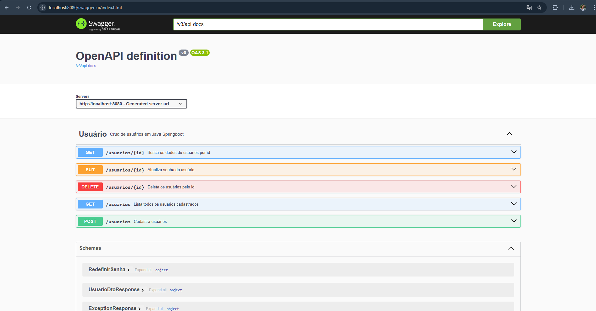
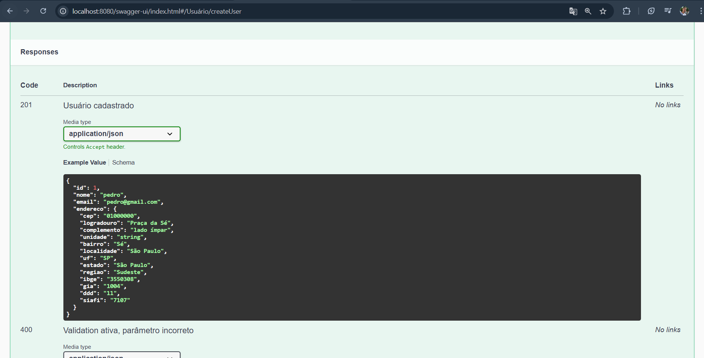

# 📦 API de Gerenciamento de Usuários


> API REST completa para gerenciamento de usuários com validações robustas, tratamento de exceções e documentação interativa via Swagger/OpenAPI.

---

## 📋 Sobre o Projeto

Esta API foi desenvolvida como parte de um bootcamp da plataforma [DIO](https://www.dio.me/), com o objetivo de criar um sistema profissional de CRUD de usuários aplicando as melhores práticas de desenvolvimento.

### ✨ Principais Características

- ✅ **CRUD Completo** - Criar, listar, atualizar e deletar usuários
- ✅ **Validações Robustas** - Bean Validation para garantir integridade dos dados
- ✅ **Tratamento de Exceções** - Respostas HTTP padronizadas e mensagens de erro claras
- ✅ **Documentação Interativa** - Swagger UI para testar endpoints facilmente
- ✅ **Perfis de Ambiente** - Configurações separadas para desenvolvimento e produção
- ✅ **Persistência em H2 Database** - Banco de dados para testes

---

## 🚀 Tecnologias Utilizadas

### Back-end
- **Java 21** - Linguagem de programação
- **Spring Boot 3.5** - Framework para desenvolvimento de aplicações
- **Spring Data JPA** - Persistência de dados
- **Hibernate** - ORM (Object-Relational Mapping)

### Banco de Dados
- **H2 Database** - Banco de dados de teste relacional

### Documentação
- **SpringDoc OpenAPI 3** - Geração automática de documentação
- **Swagger UI** - Interface interativa para testes

### Validação
- **Bean Validation (Jakarta)** - Validação de dados de entrada

### Build & Deploy
- **Maven** - Gerenciamento de dependências
---

## 📸 Screenshots

### Swagger UI - Endpoints Disponíveis


### Exemplo de Resposta


---

## 🛠️ Pré-requisitos

Antes de começar, você vai precisar ter instalado em sua máquina:

- [Java JDK 21+](https://www.oracle.com/java/technologies/downloads/)
- [Maven 3.8+](https://maven.apache.org/download.cgi)
- [Git](https://git-scm.com/downloads)

---

## 🔧 Como Executar o Projeto

### 1️⃣ Clone o repositório

```bash
git clone https://github.com/PedroNunes-Dev67/Crud-Usuario-Swagger.git
cd Crud-Usuario-Swagger
```

### 2️⃣ Execute a aplicação

```bash
# Usando Maven
mvn spring-boot:run

# Ou compilando o JAR
mvn clean package
java -jar target/crud-usuario-swagger-0.0.1-SNAPSHOT.jar
```

### 3️⃣ Acesse a documentação Swagger

Abra seu navegador e acesse:

```
http://localhost:8080/swagger-ui.html
```

---

## 📚 Endpoints da API

| Método | Endpoint | Descrição |
|--------|----------|-----------|
| `GET` | `/usuarios` | Lista todos os usuários |
| `GET` | `/usuarios/{id}` | Busca usuário por ID |
| `POST` | `/usuarios` | Cria um novo usuário |
| `PUT` | `/usuarios/{id}` | Atualiza dados do usuário |
| `DELETE` | `/usuarios/{id}` | Remove um usuário |

---

## 📝 Exemplo de Requisição

### POST `/usuarios` - Criar novo usuário

**Request Body:**
```json
{
  "nome": "Pedro Nunes",
  "email": "pedro@example.com",
  "senha":"1234"
}
```

**Response (201 Created):**
```json
{
  "id": 1,
  "nome": "Pedro Nunes",
  "email": "pedro@example.com"
}
```

---

## ✅ Validações Implementadas

A API possui validações robustas para garantir a qualidade dos dados:

| Campo | Validações |
|-------|------------|
| **Nome** | Não pode ser vazio |
| **Email** | Formato de email válido; Único no sistema |
| **Senha** | Não pode ser vazia |

---

## 🔒 Tratamento de Exceções

A API retorna respostas HTTP padronizadas para diferentes cenários:

| Status Code | Descrição |
|-------------|-----------|
| `200 OK` | Requisição bem-sucedida |
| `201 Created` | Recurso criado com sucesso |
| `400 Bad Request` | Dados de entrada inválidos |
| `404 Not Found` | Recurso não encontrado |
| `409 Conflict` | Conflito (ex: email já cadastrado) |
| `500 Internal Server Error` | Erro interno do servidor |

**Exemplo de resposta de erro:**
```json
{
  "moment": "2025-12-27T10:30:00Z",
  "status": 409,
  "error": "Conflict",
  "message": "Email já cadastrado no sistema",
  "path": "/usuarios"
}
```

---


## 📦 Build do Projeto

Para gerar o arquivo JAR executável:

```bash
mvn clean package
```

O arquivo será gerado em: `target/crud-usuario-swagger-0.0.1-SNAPSHOT.jar`

---

## 🌱 Próximas Melhorias

- [ ] Implementar autenticação JWT
- [ ] Adicionar paginação nos endpoints de listagem
- [ ] Criar testes unitários com JUnit e Mockito
- [ ] Implementar soft delete (exclusão lógica)
- [ ] Adicionar filtros de busca (por nome, email, etc)
- [ ] Configurar Docker Compose
- [ ] Deploy em produção (Railway/Render)

---

## 🤝 Contribuições

Contribuições são sempre bem-vindas! Para contribuir:

1. Faça um fork do projeto
2. Crie uma branch para sua feature (`git checkout -b feature/MinhaFeature`)
3. Commit suas mudanças (`git commit -m 'Adiciona nova feature'`)
4. Push para a branch (`git push origin feature/MinhaFeature`)
5. Abra um Pull Request

---

## 📄 Licença

Este projeto está sob a licença MIT. Veja o arquivo [LICENSE](LICENSE) para mais detalhes.

---

## 👤 Autor

**Pedro Nunes**

- 🔗 GitHub: [@PedroNunes-Dev67](https://github.com/PedroNunes-Dev67)
- 💼 LinkedIn: [Pedro Nunes](https://www.linkedin.com/in/pedro-nunes-dev67)
- 📧 Email: pedrovitornunes89@gmail.com
- 📱 Telefone: (81) 99102-4299

---

## 🙏 Agradecimentos

- [DIO](https://www.dio.me/) - Pela plataforma de ensino e pelo bootcamp
- [Spring Framework](https://spring.io/) - Pela excelente documentação
- [SpringDoc OpenAPI](https://springdoc.org/) - Pela facilidade de integração do Swagger

---

<div align="center">

### ⭐ Se este projeto foi útil para você, considere dar uma estrela!

**Desenvolvido com ☕ e 💙 por Pedro Nunes**

</div>
